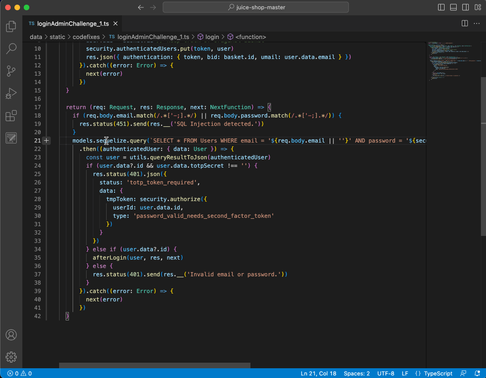
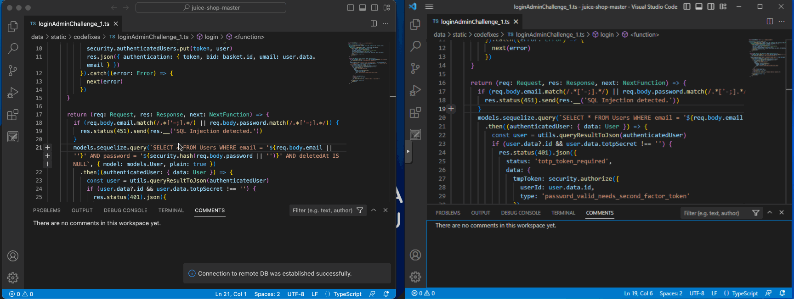
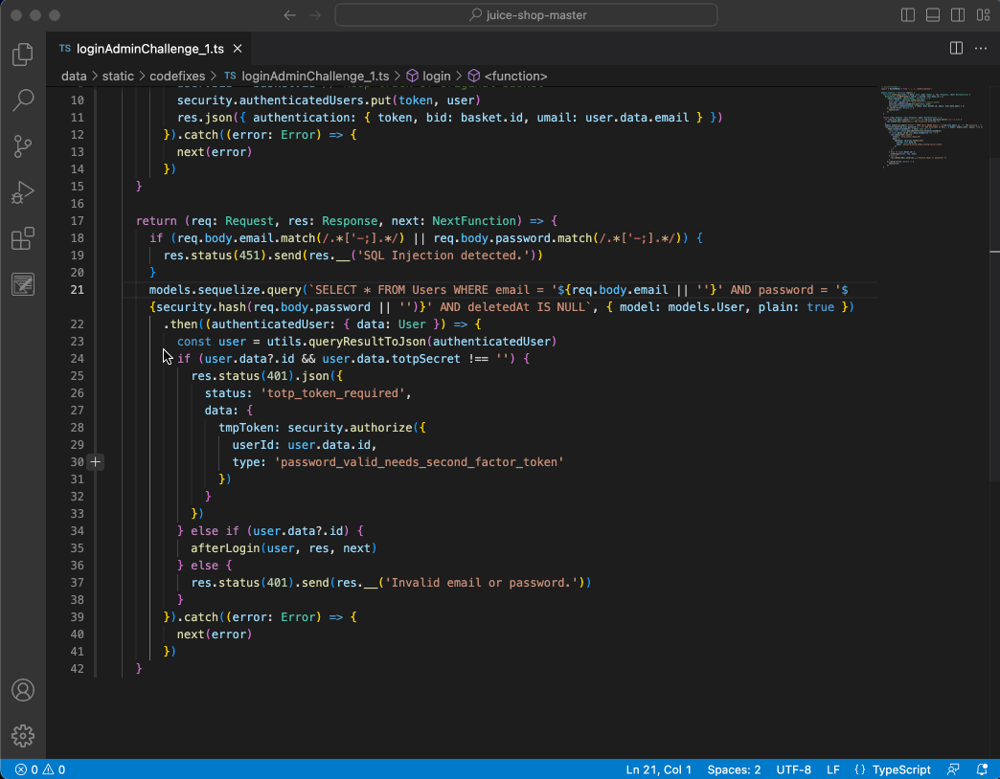
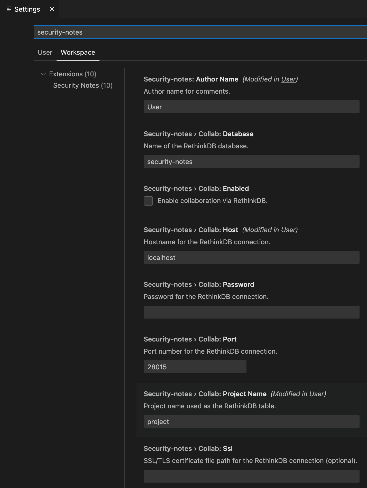

<h1 align="center">
  <sub>
    
  </sub>
  <sup>
    Security Notes
  </sup>
</h1>
<p align="center">
    A Visual Studio Code extension to aid code reviews from a security perspective.
</p>

---

Security Notes allows the creation of notes within source files, which can be replied to, reacted to using emojis, and assigned statuses such as "TODO", "Vulnerable" and "Not Vulnerable".

Also, it allows importing the output from SAST tools (such as semgrep, bandit and brakeman), into notes, making the processing of the findings much easier.

Finally, collaborate with others by using a centralized database for notes that will be automatically synced in **real-time**! Create a note locally, and it will be automatically pushed to whoever is working with you on the project.

## Try it out!

Download the extension directly from the Visual Studio [Marketplace](https://marketplace.visualstudio.com/items?itemName=refactor-security.security-notes) and you should be ready to go :)

### Alternative installation methods

Please follow any of the alternatives below:

- Download the [latest release](https://github.com/RefactorSecurity/vscode-security-notes/releases) file (with the `.vsix` extension) and install manually in VSCode via **Extensions** > **Install From VSIX**
- Build the extension yourself
  - Clone the repo
  - Install VS Code Extension Manager via `npm install -g @vscode/vsce`
  - Create a `.vsix` package via `vsce package`

## Basic Usage

Security Notes allows the creation of notes within source files, which can be replied to, reacted to using emojis, and assigned statuses such as "TODO", "Vulnerable" and "Not Vulnerable".



## Local database for Comments

By default your notes are backed up in a JSON file once you close VSCode. Once you open the project again, saved comments are loaded and shown on the UI.

## Collaboration Mode

Because chasing bugs with friends is more fun :)

Security Notes allows sharing of notes in real-time with other users. To do so, it leverages the RethinkDB real-time database.

First, make sure you have a RethinkDB database instance up and running. Then set your author name, and the database connection information in the extension's settings, and you are ready to go! Please see the section below for more details).

Collaboration mode in action:



### Setting up the RethinkDB database

We recommend following instructions in RethinkDB [installation guide](https://rethinkdb.com/docs/install/). Additionally, following [hardening steps](https://rethinkdb.com/docs/security/#wrapper), such as setting a password for the `admin` user and setting up SSL/TLS, are strongly encouraged.

Naturally, you will want to collaborate with remote peers. To do so in a secure way, we recommend setting up access to RethinkDB via SSH or through a VPN like [Tailscale](http://tailscale.com). This way, you avoid having to expose the instance to any network, and also ensuring information in transit is encrypted.

> **Important Notices:** When collaborating with others, ensure that all VSCode instances open the project from the same relative location. For example, if the source code repository you're reviewing has a directory structure like `source_code/app/src`, all peers should open VScode at the same level. Security Notes will store note location using relative paths, so they should be consistent. Also, after enabling the collaboration setting, VSCode would need to be restarted/reloaded for the change to have effect.

## Importing SAST results

The extension allows you to import the output from SAST tools into notes, making the processing of the findings much easier:



Currently supported tools include:

- bandit (https://bandit.readthedocs.io/en/latest/)
- brakeman (https://brakemanscanner.org/)
- checkov (https://www.checkov.io/)
- gosec (https://github.com/securego/gosec)
- semgrep (https://semgrep.dev/)

For imports to be successful, we recommend running commands as follows (exporting results as JSON), and making sure to run these tools from the project's folder (so that all relative paths can be processed correctly):

```bash
# bandit
bandit -f json -o bandit-results.json -r .
# brakeman
brakeman -f json -o brakeman-results.json .
# checkov
checkov -d . -o json --output-file-path checkov-results.json
# gosec
gosec -fmt=json -out=gosec-results.json ./...
# semgrep
semgrep scan --json -o semgrep-results.json --config=auto .
```

## Exporting notes in popular formats

Currently we only support exporting notes to Markdown, but other formats such as HTML are coming soon.

## Extension Settings

Various settings for the extension can be configured in VSCode's User Settings page (`CMD+Shift+P` / `Ctrl + Shift + P` -> _Preferences: Open Settings (UI)_):



## Contributing

We welcome contributions to Security Notes! These are the many ways you can help:

- Report bugs
- Submit patches and features
- Add support for additional SAST tools
- Follow us on [Twitter](https://twitter.com/refactorsec) :)

## Development and Debugging

- Clone the repo
- Run `npm install` to install dependencies
- Run the `Run Extension` target in the Debug View. This will:
  - Start a task `npm: watch` to compile the code
  - Run the extension in a new VS Code window

## Acknowledgments

This project is based on the [comment-sample](https://github.com/microsoft/vscode-extension-samples/tree/main/comment-sample) extension.

Additionally, the code for the note reactions was inspired by [comment-reactions](https://github.com/hacke2/vscode-extension-samples/tree/feat/comment-reactions).

## License

Licensed under the [MIT](LICENSE.md) License.
